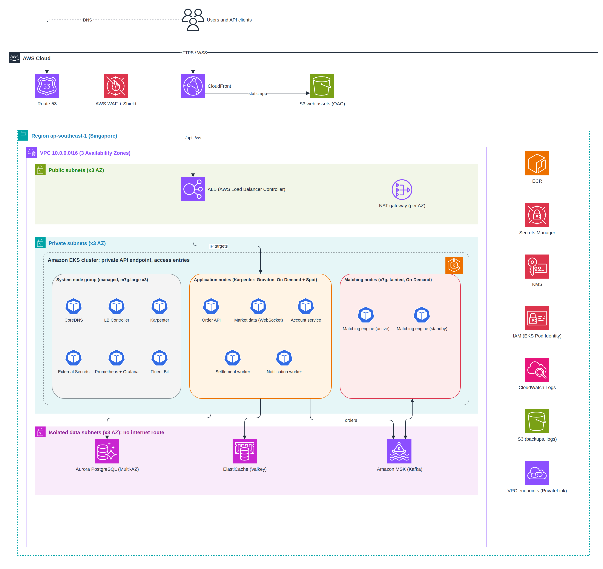
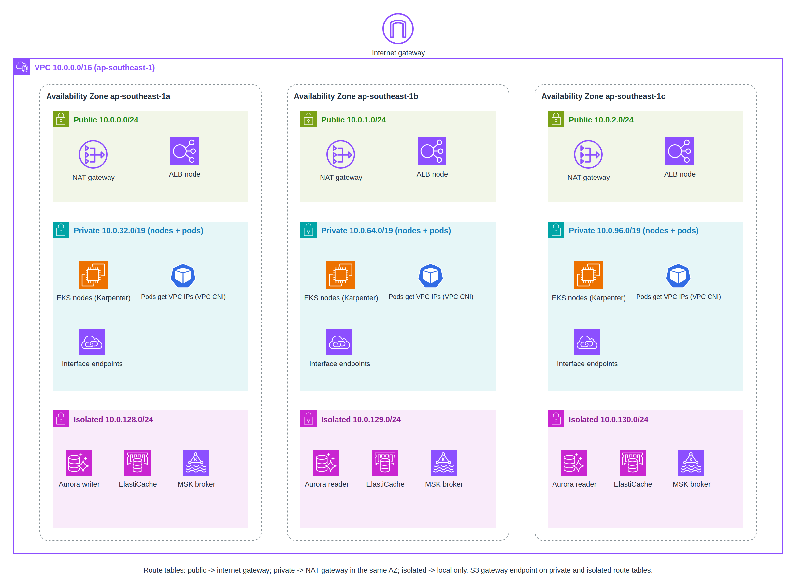

# Problem 1: Building Castle In The Cloud

## Executive Summary

The brief asks for a highly available trading platform (Binance-like) on AWS that serves **500 requests/second** with **p99 latency under 100 ms**, is cost-effective, and has a clear path to scale.

This design treats **Amazon EKS as the core**: every application service runs on one Kubernetes cluster, and every other AWS service in the design exists to **feed, protect, store for, or observe** that cluster. The principles:

- **One platform, many workloads.** Teams ship containers to EKS; they do not provision infrastructure per service.
- **Managed state outside the cluster.** Databases, cache and streaming run as AWS managed services. The cluster stays stateless and replaceable.
- **Highly available by default.** Everything spans 3 Availability Zones from day one.
- **Right-sized now, elastic later.** Karpenter adds and removes nodes in seconds, so we pay for today's traffic, not next year's.

| Document | Covers |
|---|---|
| This file (Problem 1) | The platform: EKS and its supporting services |
| [Problem 3](../problem3/SOLUTION.md) | Observability: CloudWatch for supporting services, Prometheus + Grafana for the cluster |
| [Problem 5](../problem5/SOLUTION.md) | Security hardening of the EKS cluster |

---

## Scope

The focus is the **hosting platform**, not application code.

| Capability | Included | Provided by |
|---|---|---|
| Container platform for all services | ✅ | Amazon EKS + Karpenter |
| Public entry, TLS, DDoS and WAF protection | ✅ | Route 53, CloudFront, AWS WAF, Shield |
| Load balancing into the cluster | ✅ | ALB via AWS Load Balancer Controller |
| Relational data (users, orders, ledger) | ✅ | Aurora PostgreSQL |
| Low-latency cache (balances, sessions, rate limits) | ✅ | ElastiCache for Valkey |
| Event streaming (orders, trades, market data) | ✅ | Amazon MSK |
| Container images, secrets, encryption keys | ✅ | ECR, Secrets Manager, KMS |
| Static frontend hosting | ✅ | S3 + CloudFront |
| Multi-region active-active | ❌ | Out of scope; see "What We Deliberately Avoid" |
| Application internals (matching algorithm, ledger schema) | ❌ | Application team's concern; the platform only has to host them well |

---

## Architecture Overview

### Platform Architecture



### Network Layout



> Editable draw.io sources are in `diagrams/`.

---

## Request Flow

### Path 1: Web and REST API

```
User
 → Route 53 (DNS)
   → CloudFront (TLS at the edge, AWS WAF, Shield)
     ├─ /*      → S3 bucket (static web app, Origin Access Control)
     └─ /api/*  → ALB (public subnets; accepts CloudFront traffic only)
                   → Pod IPs directly (ALB "IP target" mode, no NodePort hop)
                     → Order API / Account service pods (private subnets)
                       → ElastiCache (balance check), MSK (order event), Aurora (records)
```

### Path 2: Real-time Market Data (WebSocket)

```
User (wss://) → CloudFront (/ws/*) → ALB → Market data pods → subscribed to MSK topics
```

ALB supports WebSocket natively, and CloudFront passes WebSocket upgrades through, so REST and WebSocket share one entry point and one set of edge protections.

### Path 3: Operators

```
Engineer → IAM Identity Center (SSO + MFA) → EKS access entry → private EKS API endpoint
```

No bastion host and no public Kubernetes API. Details are in Problem 5.

### Latency Budget (p99, order placement)

| Hop | Budget |
|---|---|
| Client to CloudFront edge, WAF inspection | 15 ms |
| CloudFront to ALB to pod (warm, same region) | 10 ms |
| Order API logic + ElastiCache balance hold | 10 ms |
| Publish to MSK (`acks=all`, replicated to 2 AZs) | 15 ms |
| **Total** | **~50 ms, leaving 50 ms headroom for p99 spikes** |

The API responds once the order is **durably accepted** in MSK; matching and settlement happen asynchronously and results are pushed over WebSocket.

---

## Component Deep-Dive

### 1. The Core: Amazon EKS

| Aspect | Decision |
|---|---|
| **Cluster** | One production cluster in `ap-southeast-1` (Singapore), spanning 3 AZs. Staging is a separate cluster in a separate AWS account |
| **Kubernetes version** | Latest version in EKS standard support; upgraded at least twice a year, never allowed to reach extended support (which costs 6x more per hour) |
| **API endpoint** | Private only. Reachable from inside the VPC and through SSO-authenticated access |
| **Authentication** | EKS access entries (API mode), not the legacy `aws-auth` ConfigMap |
| **Workload identity** | EKS Pod Identity: each service account maps to its own narrowly scoped IAM role |
| **Networking** | Amazon VPC CNI: every pod gets a real VPC IP, so security groups, ALB IP targets and VPC Flow Logs all see pods directly |
| **Node OS** | Bottlerocket: minimal, immutable, container-only OS |

**Why EKS as the core (not ECS):** see ADR-001 below. In short, a trading platform accumulates many services and platform tools (autoscaling, secrets sync, policy, monitoring, GitOps). Kubernetes gives one standard way to run all of them, and EKS removes the burden of running the control plane.

### 2. Compute Strategy: Three Node Pools

| Node pool | Managed by | Instances | Runs | Why separate |
|---|---|---|---|---|
| **System** | EKS managed node group | 3 x `m7g.large` (1 per AZ), On-Demand | CoreDNS, Load Balancer Controller, Karpenter, External Secrets, Prometheus/Grafana, Fluent Bit | Platform components must not be disrupted by application scaling. Karpenter cannot run on the nodes it manages |
| **Application** | Karpenter | Graviton (`m7g`, `c7g`, `r7g` families), mix of On-Demand and Spot | Order API, account service, market data, workers | Karpenter picks the cheapest instance that fits pending pods and consolidates underused nodes |
| **Matching** | Karpenter (dedicated NodePool) | `c7g.xlarge`, On-Demand only, tainted | Matching engine pods only | Needs predictable CPU; must never be interrupted by Spot reclaim or share a node with noisy workloads |

**Spot policy:** stateless, horizontally scaled services may use Spot (up to ~60% cheaper) with a PodDisruptionBudget and at least 3 replicas across AZs. Anything on the order-matching or settlement path is On-Demand.

**Graviton (ARM):** Graviton3 instances (`m7g`, `c7g`) cost less than their x86 equivalents for the same work. CI builds multi-architecture images so a workload can fall back to x86 if needed.

### 3. Cluster Add-ons (the platform's "operating system")

| Add-on | Purpose | Installed as |
|---|---|---|
| Amazon VPC CNI | Pod networking with VPC IPs; network policy enforcement | EKS managed add-on |
| CoreDNS, kube-proxy | Service discovery and routing | EKS managed add-on |
| EKS Pod Identity Agent | Hands IAM credentials to pods | EKS managed add-on |
| Amazon EBS CSI driver | Persistent volumes (Prometheus storage) | EKS managed add-on |
| AWS Load Balancer Controller | Creates the ALB from Kubernetes Ingress objects | Helm |
| Karpenter | Just-in-time node provisioning and consolidation | Helm |
| External Secrets Operator | Syncs secrets from Secrets Manager into Kubernetes | Helm |
| metrics-server | Feeds CPU and memory to the Horizontal Pod Autoscaler | Helm |
| kube-prometheus-stack, Fluent Bit | Metrics and logs (Problem 3) | Helm |

EKS managed add-ons are patched and version-checked by AWS on upgrade; the rest are pinned Helm chart versions managed as code.

### 4. Supporting Services

| Service | Role in supporting EKS | Why this | Alternative considered |
|---|---|---|---|
| **Route 53** | DNS for the public domain | Managed, 100% SLA, alias to CloudFront | Third-party DNS: no benefit |
| **CloudFront** | Single public entry; TLS close to users; caches static assets | Protects and accelerates the cluster's only public path | Exposing the ALB directly: no edge caching or edge WAF |
| **AWS WAF + Shield** | Blocks OWASP attacks, bots and floods before they reach pods | Cheaper to drop bad traffic at the edge than to autoscale for it | In-cluster WAF (ModSecurity): consumes cluster capacity |
| **ALB** (via Load Balancer Controller) | Layer-7 routing straight to pod IPs | Native WebSocket, path routing, health checks | NGINX Ingress behind an NLB: one more component to run and patch |
| **ECR** | Private image registry | Pulled over VPC endpoints; scanning built in | Docker Hub: rate limits, public exposure |
| **Aurora PostgreSQL** | Users, orders, ledger | ACID for money; 3-AZ storage; failover in ~30 s | Postgres inside the cluster: we would own backups, failover and storage |
| **ElastiCache (Valkey)** | Balance holds, sessions, rate limits | Sub-millisecond, managed failover; Valkey is cheaper than Redis OSS on ElastiCache | Redis in-cluster: another stateful system to operate |
| **Amazon MSK** | Ordered, durable event log between services | Per-market ordering, replay, exactly-once transactions | Kinesis: cheaper but no transactions. Strimzi (Kafka on EKS): operationally heavy |
| **Secrets Manager + KMS** | Credentials and encryption keys | Rotation, audit, no secrets in Git | Kubernetes Secrets alone: base64, not a secrets manager |
| **S3** | Frontend assets, backups, long-term logs | Durable, cheap | EFS: not needed; nothing shares files |
| **VPC endpoints** | Private access to ECR, S3, STS, Secrets Manager, CloudWatch | Keeps traffic off the internet and off NAT data charges | NAT only: slower, costs per GB |
| **CloudWatch** | Logs and metrics for managed services and the EKS control plane | Native for AWS services (see Problem 3) | Only Prometheus: cannot scrape managed services' internals |

---

## Implementation Specifications

### Network

| Tier | Subnets (one per AZ) | Size | Contains |
|---|---|---|---|
| Public | `10.0.0.0/24`, `10.0.1.0/24`, `10.0.2.0/24` | 251 IPs each | ALB, NAT gateways |
| Private | `10.0.32.0/19`, `10.0.64.0/19`, `10.0.96.0/19` | 8,187 IPs each | EKS nodes **and pods**, interface endpoints |
| Isolated | `10.0.128.0/24`, `10.0.129.0/24`, `10.0.130.0/24` | 251 IPs each | Aurora, ElastiCache, MSK |

**Why /19 for private subnets:** with VPC CNI every pod consumes a VPC IP. Hundreds of pods plus node warm pools exhaust a /24 quickly, and re-addressing a live cluster is painful. Prefix delegation is enabled so each node gets IPs in /28 blocks, which raises pods per node and speeds up pod start.

**NAT per AZ:** an AZ failure does not cut the other AZs off from the internet. Most AWS traffic bypasses NAT through VPC endpoints.

### Namespaces

| Namespace | Workloads | Node pool |
|---|---|---|
| `kube-system`, `karpenter`, `external-secrets` | Platform add-ons | System |
| `monitoring` | Prometheus, Grafana, Alertmanager, Fluent Bit | System |
| `trading-api` | Order API, account service | Application |
| `trading-realtime` | Market data (WebSocket) | Application |
| `trading-workers` | Settlement, notifications | Application (Spot allowed) |
| `trading-core` | Matching engine | Matching |

Each namespace has resource quotas, default resource limits and its own service accounts; Problem 5 adds network policies and pod security.

### Autoscaling

| Layer | Tool | Signal |
|---|---|---|
| Pods | Horizontal Pod Autoscaler | CPU for APIs; custom metrics (Kafka consumer lag, WebSocket connections) through Prometheus Adapter or KEDA |
| Nodes | Karpenter | Pending pods; consolidation when nodes are underused |
| Data tier | Aurora read replica autoscaling, MSK storage autoscaling | Replica CPU, disk usage |

---

## High Availability

| Failure | Impact | Recovery |
|---|---|---|
| Pod crash | None; other replicas serve traffic | Kubernetes restarts it in seconds |
| Node failure | Pods rescheduled | Karpenter launches a replacement in about a minute |
| Spot interruption | 2-minute warning; pods drained gracefully | Karpenter handles the interruption notice and replaces capacity |
| AZ outage | Two-thirds capacity remains; topology spread keeps replicas in every AZ | Karpenter adds capacity in the healthy AZs; Aurora and ElastiCache fail over automatically |
| EKS control plane issue | Running pods keep serving; only changes are blocked | AWS-managed, multi-AZ control plane |
| Region outage | Platform down | Restore in a second region from backups and infrastructure code (disaster recovery plan) |

**Target SLO:** 99.95% monthly availability for the order API.

---

## Cost Estimate (500 RPS, On-Demand, ap-southeast-1)

Rough monthly estimate; verify with the AWS Pricing Calculator.

| Component | Configuration | Monthly |
|---|---|---|
| EKS control plane | 1 cluster, standard support | $73 |
| System nodes | 3 x `m7g.large` | $220 |
| Application nodes | Karpenter, ~4 x `m7g.xlarge` equivalent, part Spot | $450 |
| Matching nodes | 2 x `c7g.xlarge` | $250 |
| Aurora PostgreSQL | Writer + reader, `db.r7g.large` | $550 |
| ElastiCache (Valkey) | 2 x `cache.r7g.large` | $370 |
| Amazon MSK | 3 x `kafka.m7g.large` + storage | $550 |
| ALB, NAT gateways (3), data transfer | | $250 |
| VPC interface endpoints | ~7 endpoints x 3 AZs | $200 |
| CloudFront, WAF, Route 53 | | $150 |
| CloudWatch, S3, Secrets Manager, KMS, ECR | | $150 |
| **Total** | | **~$3,200 / month** |

Savings levers: Compute Savings Plans for nodes (~30%), Reserved Instances for Aurora, ElastiCache and MSK, and more Spot for workers.

---

## Scaling Roadmap

### Phase 1: 500 RPS (launch)

The design above. Estimated headroom before any change: ~4x.

### Phase 2: ~5,000 RPS

| Change | Trigger |
|---|---|
| HPA scales API pods; Karpenter adds nodes automatically | CPU > 60% sustained |
| RDS Proxy in front of Aurora | Connections > 70% of maximum as pod counts grow |
| Additional Aurora readers; trade history reads moved to replicas | Writer CPU > 60% |
| More MSK partitions per busy market | Consumer lag growing |
| Dedicated matching node per hot market | Matching pod CPU > 50% |

### Phase 3: ~50,000 RPS

| Change | Why |
|---|---|
| Split into multiple clusters by domain (trading core vs. everything else) | Limit blast radius and upgrade risk; the core cluster changes rarely |
| MSK expansion with tiered storage | Throughput and cheap long retention |
| Market data served through a dedicated NLB and conflated updates | Hundreds of thousands of WebSocket connections |
| Aurora sharding or Aurora Limitless Database | Write throughput |
| Warm standby region | Regulatory and business continuity needs |

### What Does Not Change

EKS remains the core, the VPC layout stays (subnets were sized for growth), and teams keep deploying the same way.

---

## Architecture Decision Records

### ADR-001: EKS over ECS as the Core Platform

**Status:** Accepted

**Context:** We need one platform for ~10 application services plus platform tooling (autoscaling, secrets sync, policy enforcement, monitoring, GitOps).

**Decision:** Amazon EKS.

**Rationale:**
- A large ecosystem of standard tools (Karpenter, External Secrets, Prometheus, Kyverno, Argo CD) instead of custom glue.
- Fine-grained scheduling: taints, affinity and topology spread give the matching engine dedicated, isolated capacity.
- Portable skills and manifests; hiring for Kubernetes is easier than for proprietary tooling.

**Trade-offs:** $73/month control plane per cluster, twice-yearly version upgrades, and a steeper learning curve than ECS. Accepted because the platform is the product's core and will grow.

**Rejected:** ECS (simpler, but fewer scheduling controls and a thinner tool ecosystem); self-managed Kubernetes on EC2 (we would own the control plane and etcd).

### ADR-002: Karpenter for Node Provisioning

**Status:** Accepted

**Decision:** Karpenter for application and matching nodes; a small EKS managed node group for system components.

**Rationale:** Karpenter provisions the right instance type for pending pods in about a minute, mixes Spot and On-Demand, consolidates underused nodes and rotates nodes on a schedule (useful for patching, see Problem 5).

**Rejected:** Cluster Autoscaler (slower, tied to fixed node group instance types). **EKS Auto Mode** was considered: it manages Karpenter, core add-ons and node OS for you, at an extra per-instance fee. It is a good option for a small team; we keep control of the configuration here, but it is worth revisiting.

### ADR-003: EKS Pod Identity for Workload Access to AWS

**Status:** Accepted

**Decision:** Each Kubernetes service account is associated with its own IAM role through EKS Pod Identity.

**Rationale:** Pods never use the node's IAM role or static keys. Pod Identity is simpler than IRSA: no per-cluster OIDC provider, role trust policies are reusable across clusters, and associations are managed through the EKS API.

**Rejected:** Node instance roles for pods (any pod on a node could use them); static access keys (leak risk, no rotation).

### ADR-004: Keep State out of the Cluster

**Status:** Accepted

**Decision:** Databases, cache and streaming run as AWS managed services, not as StatefulSets in EKS.

**Rationale:** Losing or rebuilding the cluster must never risk data. Managed services give backups, patching, multi-AZ failover and encryption without us running operators. This also makes cluster upgrades and disaster recovery much simpler: a cluster can be recreated from code.

**Trade-offs:** Higher cost than self-hosting, less tuning control. Accepted: data safety comes first for a financial platform.

### ADR-005: Separate Cluster per Environment

**Status:** Accepted

**Decision:** Staging and production are separate clusters in separate AWS accounts (not namespaces in one cluster).

**Rationale:** A mistake in staging (bad policy, runaway pod, upgrade gone wrong) cannot affect production. Cluster upgrades are rehearsed on staging first.

---

## Monitoring and Observability

Summarized here, detailed in [Problem 3](../problem3/SOLUTION.md):

| Layer | Tool |
|---|---|
| EKS control plane (API server, audit, authenticator logs) | CloudWatch Logs |
| Managed services (Aurora, ElastiCache, MSK, ALB, CloudFront) | CloudWatch metrics and logs |
| Pods and nodes (metrics) | Prometheus + Grafana |
| Pod logs | Fluent Bit |

---

## What We Deliberately Avoid

| Anti-pattern | Why |
|---|---|
| Databases inside Kubernetes | Couples data safety to cluster health; managed services do it better |
| One cluster for all environments | Staging mistakes become production incidents |
| Public Kubernetes API endpoint | Unnecessary attack surface; SSO plus private endpoint covers every need |
| Service mesh at launch | Adds latency and operational complexity; revisit when mTLS or advanced traffic shaping is required |
| Multi-region active-active | Order matching needs one source of truth per market; active-active adds consistency problems without clear benefit at this scale |
| Many small node groups | Karpenter's flexible NodePools replace them with less waste |

---

## Key Insight

The cluster is the **core**, but it is deliberately **disposable**: all state lives in managed services, all configuration lives in code, and all identity comes from IAM. That combination is what lets the platform scale, upgrade and recover without heroics, and it is the foundation Problems 3 and 5 build on.
