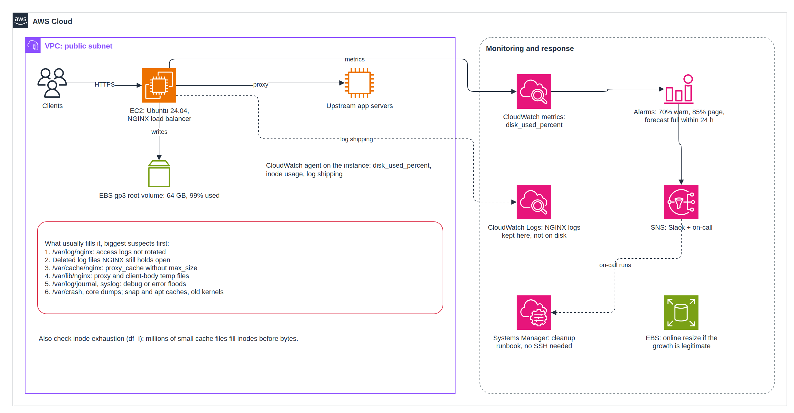

# Problem 2: Diagnose Me Doctor

> **Scenario:** An EC2 instance running Ubuntu 24.04 with 64 GB of storage is used only as an NGINX load balancer. Its disk usage has reached **99%**. Troubleshoot it: explain the possible root causes, their impact, and how to recover.

This document is written as an **on-call runbook**: an engineer should be able to follow it top to bottom during an incident. It ends with how the EKS platform from [Problem 1](../problem1/SOLUTION.md) avoids this class of problem entirely.

---

## Context



| Fact | Consequence |
|---|---|
| The VM only runs NGINX as a load balancer | NGINX itself needs well under 1 GB. Anything big is a **side effect** (logs, cache, temp files), not real data |
| One 64 GB root volume (Ubuntu's default layout) | Logs, cache, temp files and the OS all compete for the same space |
| 99%, not 100% yet | There is a short window to act before things start failing |

---

## Principles for This Incident

1. **Stabilize first, investigate second.** Free a little space safely so the box survives the next traffic spike.
2. **Never `rm` a file NGINX has open.** The space is not released until NGINX closes it. Truncate or rotate instead.
3. **Keep evidence.** Save what you need to find the root cause before cleaning up.
4. **Fix the cause, then add the alert that should have caught it.** A 64 GB disk does not fill up in minutes; nobody was warned while it grew.

---

## Step 1: Assess (First 5 Minutes)

```bash
df -hT /                                   # how full, which filesystem
df -i /                                    # inodes can run out before bytes do
systemctl status nginx --no-pager          # is NGINX running?
curl -s -o /dev/null -w '%{http_code}\n' http://localhost/   # is it still serving?
grep -i "no space" /var/log/nginx/error.log | tail -5        # already failing?
```

Then tell the team:

```
[INCIDENT] NGINX LB <hostname>: disk at 99%. Service currently UP / DEGRADED.
Investigating; next update in 15 minutes.
```

### Impact: What Actually Breaks

NGINX does **not** simply stop at 100%. It keeps proxying small requests from memory, so health checks stay green while real failures pile up:

| What fails | Why | User impact |
|---|---|---|
| Large responses and uploads | NGINX buffers big bodies to temp files under `/var/lib/nginx`; the writes fail | Downloads and uploads break with 5xx errors, while small requests still work |
| Access and error logs | Log writes fail silently | No visibility during the incident; audit and security gap |
| Proxy cache | Cache writes fail | More load on the backends, higher latency |
| Config reloads, certificate renewal | Need to write temp and PID files; certbot writes new certificates | A config change or certificate expiry in the next days becomes a full outage |
| Rest of the OS (apt, cron, journald, SSM agent) | Every process needs some disk | Patching, remote management and logins degrade |

---

## Step 2: Buy Time Safely (Next 10 Minutes)

Each action below frees space without losing anything important:

```bash
# 1. Shrink the systemd journal
sudo journalctl --vacuum-size=200M

# 2. Clear the apt package cache
sudo apt-get clean

# 3. Huge access log: keep the recent part in RAM (/dev/shm), then truncate in place.
#    Truncating keeps NGINX's file handle valid and frees the space immediately.
sudo tail -n 200000 /var/log/nginx/access.log > /dev/shm/access-tail.log
sudo truncate -s 0 /var/log/nginx/access.log

# 4. If the space is held by deleted files (see Root Cause 2), make NGINX reopen its logs
sudo nginx -s reopen
```

**Last resort: grow the EBS volume online** (no downtime):

```bash
aws ec2 modify-volume --volume-id vol-0abc123 --size 96
# once the modification reaches "optimizing", on the instance:
sudo TMPDIR=/dev/shm growpart /dev/nvme0n1 1   # growpart needs temp space; the disk has none
sudo resize2fs /dev/nvme0n1p1
```

Caveats: a volume can be modified only once every 6 hours and can never shrink. Growing buys time; it does not fix the cause.

---

## Step 3: Investigation

Start broad, then narrow down:

```bash
sudo du -xh --max-depth=1 / 2>/dev/null | sort -rh | head       # -x: stay on this filesystem
sudo du -xh --max-depth=2 /var 2>/dev/null | sort -rh | head
sudo find / -xdev -type f -size +500M -exec ls -lh {} \; 2>/dev/null
sudo lsof -nP +L1                                                # deleted but still open
```

### Decision Table

The key question: **does `du` agree with `df`?**

| What you see | Most likely cause |
|---|---|
| `du` finds the space, mostly in `/var/log/nginx` | Root Cause 1: logs not rotated |
| `df` says ~63 GB used, but `du` only finds ~20 GB | Root Cause 2: deleted files still held open |
| Space in `/var/cache/nginx`, or `df -i` at 100% | Root Cause 3: unbounded proxy cache |
| Space in `/var/lib/nginx` (`proxy_temp`, `client_body_temp`) | Root Cause 4: temp files |
| Space in `/var/log/journal` or `/var/log/syslog` | Root Cause 5: system log flood |
| Space in `/var/crash`, `/var/lib/snapd`, `/var/cache/apt`, `/usr/src` | Root Cause 6: OS housekeeping |

---

## Root Causes

### Root Cause 1: NGINX Logs Not Rotated (Most Likely)

A load balancer logs every request. At a few hundred requests per second, the access log grows by several GB per day.

Ubuntu's `nginx` package ships a logrotate rule, so when this happens, rotation has usually been **broken**, for example:
- `access_log` was moved to a custom path (such as `/var/log/nginx/lb/access.log`) that the default `/var/log/nginx/*.log` pattern does not match.
- Rotation runs daily, but one day of logs is bigger than the free space.
- Rotation failed once the disk was nearly full (compression needs space), so the problem compounded.

**How to identify:**
```bash
ls -lhS /var/log/nginx/
cat /etc/logrotate.d/nginx
grep nginx /var/lib/logrotate/status          # when did rotation last succeed?
sudo logrotate -d /etc/logrotate.d/nginx      # dry run: shows what it would do
```

**Impact:** gradual fill until the disk is full; then the failures in the impact table above.

**Immediate fix:** truncate the log in place (Step 2).

**Permanent fix:** make rotation size-aware and run it hourly:

```conf
# /etc/logrotate.d/nginx
/var/log/nginx/*.log /var/log/nginx/*/*.log {
    daily
    maxsize 1G          # rotate early when a log passes 1 GB
    rotate 7
    compress
    delaycompress
    missingok
    notifempty
    create 0640 www-data adm
    sharedscripts
    postrotate
        [ -s /run/nginx.pid ] && kill -USR1 "$(cat /run/nginx.pid)"
    endscript
}
```

Then run logrotate hourly (`sudo systemctl edit logrotate.timer`, set `OnCalendar=hourly`), and ship logs to CloudWatch Logs so only a day or two is kept locally.

---

### Root Cause 2: Deleted Files Still Held Open

Someone ran `rm access.log` to free space. The file disappears from the directory, but NGINX still has it open and keeps writing to it, so the space is **never released**. `du` cannot see it; `df` still counts it.

**How to identify:**
```bash
sudo lsof -nP +L1 | grep nginx     # files marked "(deleted)" held by nginx
```

**Impact:** confusing investigations (the disk is "full of nothing"), and every cleanup attempt with `rm` makes it worse.

**Fix:** `sudo nginx -s reopen`. NGINX closes the old files and opens new ones; the space is freed instantly.

**Prevent:** runbooks say "truncate, never `rm`", and logrotate always signals NGINX after rotating.

---

### Root Cause 3: Proxy Cache Without a Size Limit

If NGINX caches backend responses (`proxy_cache_path`) without `max_size`, the cache grows until the disk is full. With many small objects, **inodes** run out first, and the disk reports "No space left on device" while `df -h` still shows free space.

**How to identify:**
```bash
sudo du -sh /var/cache/nginx
df -i /
sudo nginx -T | grep proxy_cache_path
```

**Fix and prevent:** cap the cache so NGINX's cache manager evicts old entries by itself:

```nginx
proxy_cache_path /var/cache/nginx levels=1:2 keys_zone=lb_cache:50m
                 max_size=8g inactive=60m use_temp_path=off;
```

Clearing the cache is safe (it only costs some extra backend load), after the limit is in place and NGINX is reloaded.

---

### Root Cause 4: Proxy and Upload Temp Files

NGINX writes responses larger than its memory buffers, and uploads larger than `client_body_buffer_size`, to temp files. A burst of large downloads or uploads, or files left behind after worker crashes, can fill `/var/lib/nginx`.

**How to identify:**
```bash
sudo du -sh /var/lib/nginx/*
sudo find /var/lib/nginx -type f -mmin +60 | wc -l     # stale temp files
```

**Fix and prevent:** stale files older than an hour can be deleted. Limit disk buffering per response with `proxy_max_temp_file_size 512m;` and cap uploads with `client_max_body_size`.

---

### Root Cause 5: System Log Flood

`journald` defaults to 10% of the filesystem (capped at 4 GB), and `rsyslog` writes a second copy to `/var/log/syslog`. A crash-looping service or forgotten debug logging can fill both quickly.

**How to identify:**
```bash
journalctl --disk-usage
ls -lhS /var/log | head
journalctl -p warning --since "1 hour ago" | tail -20    # who is noisy?
```

**Fix and prevent:** vacuum the journal, fix the noisy service, and cap the journal permanently:

```ini
# /etc/systemd/journald.conf.d/limits.conf
[Journal]
SystemMaxUse=1G
MaxRetentionSec=7day
```

---

### Root Cause 6: OS Housekeeping

Small individually, but they add up over months:
- Crash reports and core dumps in `/var/crash` (a crashing NGINX worker is a separate bug to chase)
- Old kernels and headers left behind by unattended upgrades
- The apt package cache
- Old snap revisions (Ubuntu keeps several by default)
- If Docker was installed "just for one thing": old images and unbounded container logs (`docker system df`)

**Fix:**
```bash
sudo apt-get clean && sudo apt-get autoremove --purge
sudo snap set system refresh.retain=2
```

---

## Step 4: Verify Recovery

```bash
df -h / && df -i /                                       # comfortably below 70%
sudo nginx -t && sudo systemctl reload nginx             # config and reload work again
curl -s -o /dev/null -w '%{http_code}\n' http://localhost/
sudo logrotate -f /etc/logrotate.d/nginx && ls -lh /var/log/nginx   # rotation works
tail -n 3 /var/log/nginx/access.log                      # logging resumed
```

---

## Prevention and Monitoring

| Control | Detail |
|---|---|
| **CloudWatch agent** | Publishes `disk_used_percent` and `disk_inodes_free`, and ships NGINX logs to CloudWatch Logs |
| **Tiered alarms** | 70% for 30 min: Slack. 85%: page on-call. 95%: urgent page. Inodes below 10% free: page |
| **Growth-rate alarm** | Disk usage rising more than 5 points in an hour: Slack. Catches floods early, before any threshold |
| **Everything bounded** | logrotate with `maxsize`, `proxy_cache_path max_size`, `proxy_max_temp_file_size`, journald limits |
| **Separate volume for `/var/log` and `/var/cache/nginx`** | A full log volume cannot take the OS down with it |
| **Golden AMI** | These settings are baked into the image (EC2 Image Builder), so new instances are safe from day one |

### Alert Thresholds

| Alert | Threshold | Channel | Expected response |
|---|---|---|---|
| Disk warning | > 70% for 30 min | Slack | Investigate within a working day |
| Disk critical | > 85% | PagerDuty | Investigate within 1 hour |
| Disk emergency | > 95% | PagerDuty (high) | Immediate |
| Inodes low | < 10% free | PagerDuty | Investigate within 1 hour |
| Fast growth | > 5 points per hour | Slack | Check for a log flood or traffic spike |

---

## How Our EKS Platform Avoids This

This incident is typical of a **hand-managed, single VM**. The platform in Problem 1 removes the conditions that cause it:

| VM problem | EKS platform equivalent |
|---|---|
| Self-managed NGINX VM as load balancer | AWS Application Load Balancer: managed, no disk, scales automatically |
| Access logs written to local disk | ALB access logs go straight to S3; pod logs shipped by Fluent Bit to CloudWatch Logs (Problem 3) |
| One disk shared by OS, logs and cache | Container logs are rotated by the kubelet; pods get `ephemeral-storage` limits and are evicted before a node fills |
| Long-lived server that accumulates junk | Karpenter replaces nodes every 14 days with a fresh Bottlerocket image (Problem 5) |
| Found by a human noticing 99% | Prometheus alerts on node disk pressure and filesystem growth; Kubernetes itself reports `DiskPressure` |

---

## Postmortem Template

```markdown
## Incident: Disk full on NGINX load balancer

Date / Duration / Severity / On-call:

### Timeline
- HH:MM  Alert fired (or: users reported errors)
- HH:MM  Space freed, service stable
- HH:MM  Root cause identified
- HH:MM  Permanent fix applied

### Root cause
What filled the disk, why rotation or limits did not prevent it, and why no alert fired earlier.

### Impact
Requests failed, logs lost, duration.

### Action items
| Action | Owner | Due |
|---|---|---|
| Fix logrotate / cache limits | | |
| Add 70% / 85% / growth-rate alarms | | |
| Move logs off the instance | | |
```

---

## Key Insight

Disk-full incidents on load balancers are almost always **unbounded growth** (logs, cache or temp files) plus **missing alerts**. The recovery pattern is always the same: free space safely (truncate, do not delete), find what grew, put a limit on it, and alert early. The long-term fix is to stop running stateful, hand-managed load balancer VMs at all, which is what the EKS platform does.
