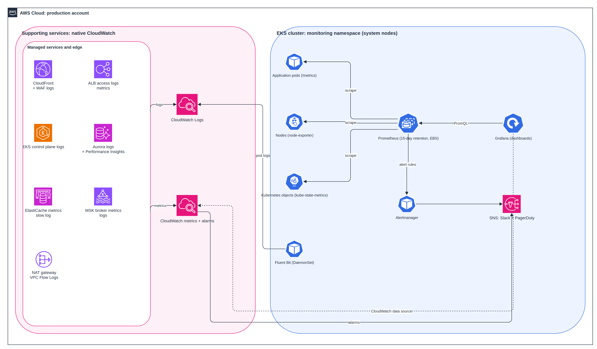

# Problem 3: Debugging Issues Within System

> **Scenario (from this folder's README):** A small platform runs on Docker Compose: NGINX, a Node.js API, PostgreSQL and Redis. Users report the API is **unreliable and sometimes inaccessible**. Identify the issues, fix them, explain the root causes, and describe the monitoring and alerts you would add and how to prevent this in production.

This report has two parts:

1. **The investigation**: what is broken in the Compose stack, how it was found, and the fixes (**applied to the code in this folder and tested**).
2. **Monitoring for production**: how the same problems would be caught on our EKS platform from [Problem 1](../problem1/SOLUTION.md), with **CloudWatch** for the supporting AWS services and **Prometheus + Grafana** for the EKS pods.

---

## Part 1: The Investigation

### Summary of Findings

| # | Severity | Component | Problem | Effect |
|---|---|---|---|---|
| 1 | Critical | NGINX | `proxy_pass http://api:3001`, but the API listens on port **3000** | Every `/api/*` request returns **502 Bad Gateway** |
| 2 | High | API | `db.release()` is skipped when a query throws | Database connections leak until the pool is exhausted |
| 3 | High | API | The `pg` pool has no connection timeout (it waits forever) | Once the pool is exhausted, requests **hang** instead of failing |
| 4 | High | API | No `error` listener on the `pg` pool | A Postgres restart **crashes** the Node process |
| 5 | High | Compose | No `restart` policy on any service | A crashed API stays down |
| 6 | Medium | NGINX | The hostname `api` is resolved once at startup | After the API container restarts with a new IP, NGINX keeps sending traffic to the old one (502s until NGINX restarts) |
| 7 | Medium | Compose | `depends_on` only orders startup; no health checks | Services start before their dependencies are ready |
| 8 | Medium | API | Redis write sits on the request path with ioredis's offline queue | If Redis is down, requests stall through retries before failing, even though the cache write is not essential |
| 9 | Medium | Postgres | `init.sql` is never mounted; if it were, `max_connections = 20` is too low | The setting is silently not applied; if applied, a few API replicas would exhaust connections |
| 10 | Medium | Postgres | No volume for data | All data is lost on `docker compose down` |
| 11 | Low | Security | Password hard-coded in `index.js` and `docker-compose.yml`; `.env` unused; container runs as root | Credential leak risk, larger blast radius |
| 12 | Low | NGINX | Empty `nginx/nginx.conf` in the repo | Not mounted today, but mounting it would stop NGINX from starting |

**Why "sometimes inaccessible" and not "always down":** bug 1 breaks every API call through NGINX. Once it is fixed, bugs 2 to 8 cause **intermittent** failures: the API works until a query fails (leak), Postgres restarts (crash), the API container restarts (stale IP), or Redis blips (stall).

### Architecture: Before and After

```
BEFORE:  User → :8080 NGINX ──✗── api:3001 (nothing listening)      API :3000 → Postgres, Redis

AFTER:   User → :8080 NGINX ──→ api:3000 (re-resolved every 10s) → Postgres (pool: max 10, 2s timeout)
                                                                  → Redis (best effort, fails fast)
         + health checks on every service, restart policies, data volume
```

### How It Was Diagnosed

| Step | Command | Finding |
|---|---|---|
| 1. Reproduce | `curl -i http://localhost:8080/api/users` | `502 Bad Gateway`, while `curl http://localhost:8080/` returns the welcome page. NGINX is up; the problem is between NGINX and the API |
| 2. Read NGINX logs | `docker compose logs nginx` | `connect() failed (111: Connection refused) while connecting to upstream, upstream: "http://<ip>:3001/..."` |
| 3. Bypass NGINX | `docker compose exec api wget -qO- localhost:3000/status` | `{"status":"ok"}`. The API is healthy on 3000; NGINX points at the wrong port **(bug 1)** |
| 4. Read the code path | Review `index.js` | Connection released only on success **(2)**, no pool timeout **(3)**, no pool error handler **(4)** |
| 5. Inject faults | `docker compose restart postgres` | API process exits; `docker compose ps` shows it `Exited` and it never comes back **(4, 5)** |
| | `docker compose stop redis` | `/api/users` stalls for seconds before failing **(8)** |
| | `docker compose up -d --force-recreate api` | NGINX returns 502 until restarted **(6)** |
| 6. Check database config | `psql -c "SHOW max_connections;"` | Returns `100`: `init.sql` was never applied **(9)** |

### Fixes

The fixes below are **applied to the files in this folder**. Run `docker compose up --build` from this directory, wait about 20 seconds for the health checks, then `curl http://localhost:8080/api/users`. The key changes are shown here for review.

#### Fix 1 and 6: NGINX (`nginx/conf.d/default.conf`)

```nginx
server {
    listen 80;
    resolver 127.0.0.11 valid=10s ipv6=off;   # Docker DNS; re-resolve "api" every 10s

    location = / { return 200 "Welcome to the platform\n"; }
    location = /healthz { access_log off; return 200 "ok\n"; }

    location /api/ {
        set $api_upstream http://api:3000;    # correct port; variable forces re-resolution
        proxy_pass $api_upstream;
        proxy_set_header Host $host;
        proxy_set_header X-Forwarded-For $proxy_add_x_forwarded_for;
        proxy_connect_timeout 2s;
        proxy_read_timeout 10s;
    }
}
```

Also delete the empty `nginx/nginx.conf` **(12)**.

#### Fixes 2, 3, 4 and 8: API (`api/src/index.js`, key changes)

```js
const pool = new Pool({
  host: process.env.DB_HOST,
  user: process.env.DB_USER,              // from environment, not hard-coded (11)
  password: process.env.DB_PASSWORD,
  database: process.env.DB_NAME,
  max: 10,
  connectionTimeoutMillis: 2000,          // fail fast instead of hanging (3)
});
pool.on("error", (err) => console.error("pg pool error:", err.message));   // no crash (4)

const redis = new Redis({
  host: process.env.REDIS_HOST,
  maxRetriesPerRequest: 1,
  enableOfflineQueue: false,              // fail immediately if Redis is down (8)
});
redis.on("error", (err) => console.error("redis error:", err.message));

app.get("/api/users", async (req, res) => {
  try {
    const result = await pool.query("SELECT NOW()");   // always releases the client (2)
    redis.set("last_call", Date.now()).catch(() => {}); // cache write is best effort (8)
    res.json({ ok: true, time: result.rows[0] });
  } catch (err) {
    console.error(err);
    res.status(500).json({ ok: false, error: "internal error" });  // no internal details leaked
  }
});

// Readiness probe: checks dependencies, used by health checks
app.get("/ready", async (req, res) => {
  try { await pool.query("SELECT 1"); res.json({ status: "ready" }); }
  catch { res.status(503).json({ status: "not ready" }); }
});
```

Plus graceful shutdown on `SIGTERM` (close the server, then the pool) so restarts do not drop in-flight requests.

#### Fixes 5, 7, 9 and 10: Compose (`docker-compose.yml`, key changes)

```yaml
services:
  nginx:
    restart: unless-stopped
    depends_on:
      api: { condition: service_healthy }

  api:
    restart: unless-stopped
    env_file: .env
    depends_on:
      postgres: { condition: service_healthy }
      redis:    { condition: service_healthy }
    healthcheck:
      test: ["CMD", "wget", "-qO-", "http://localhost:3000/ready"]
      interval: 10s
      retries: 3

  postgres:
    restart: unless-stopped
    command: ["postgres", "-c", "max_connections=100"]   # explicit, replaces unmounted init.sql (9)
    volumes: ["pgdata:/var/lib/postgresql/data"]         # data survives restarts (10)
    healthcheck:
      test: ["CMD-SHELL", "pg_isready -U postgres"]

  redis:
    restart: unless-stopped
    healthcheck:
      test: ["CMD", "redis-cli", "ping"]

volumes:
  pgdata:
```

#### Fix 11: Security Hygiene

- Credentials are no longer hard-coded: the API and Postgres read them from environment variables, which Compose fills from `.env`. The committed `.env` holds local development values only; in production they come from Secrets Manager.
- The API image runs as the non-root `node` user with `NODE_ENV=production` and installs production dependencies only. Next step: commit a `package-lock.json` and switch to `npm ci` for reproducible builds.

### Verification

The fixed API and NGINX config were tested against real PostgreSQL 16, Redis and NGINX, replaying each failure from the findings table:

| Test | Before the fix | After the fix (measured) |
|---|---|---|
| `GET /api/users` through NGINX | 502 Bad Gateway | **200** |
| Restart Postgres while the API runs | API process crashes and stays down | API stays up; next request **200** |
| Stop Redis | Requests stall through retries | **200 in 3 ms**; warning logged |
| Postgres fully down | Requests hang (no timeout) | **500 in 4 ms**; `/ready` returns **503** |
| Postgres comes back | Needs an API restart | **200** with no restart |
| 50 requests, then count DB connections | Grows with every failed query | **1** open connection |
| `SIGTERM` to the API | Killed after Docker's 10 s timeout | Exits cleanly at once |
| `nginx -t` on the new config | n/a | Syntax OK |

To reproduce with Docker:

| Command | Expected |
|---|---|
| `docker compose up --build`, then `docker compose ps` | All four services `healthy` |
| `curl localhost:8080/api/users` | `200 {"ok":true,...}` |
| `docker compose restart postgres` | API stays up and recovers on its own |
| `docker compose stop redis` | Requests still return 200; a warning is logged |
| `docker compose up -d --force-recreate api` | NGINX follows the new IP within ~10 seconds |

---

## Part 2: Monitoring and Alerts for Production

Every bug above was **silent** until users complained. On the EKS platform, the same failure modes are caught by two complementary monitoring systems:

| Scope | Tool | Why |
|---|---|---|
| **Supporting AWS services** (CloudFront, WAF, ALB, EKS control plane, Aurora, ElastiCache, MSK, NAT, VPC) | **Amazon CloudWatch** (Logs + metrics + alarms) | These services publish to CloudWatch natively; no agents to run |
| **EKS workloads** (pods, nodes, Kubernetes objects) | **Prometheus + Grafana** (kube-prometheus-stack in the `monitoring` namespace) | Kubernetes-native, service-level metrics, a huge library of ready dashboards and alert rules |
| **Pod logs** | **Fluent Bit** DaemonSet → CloudWatch Logs | One place to search logs from both worlds |



> Editable draw.io source in `diagrams/`.

### Supporting Services: CloudWatch

| Service | What we collect | Retention |
|---|---|---|
| EKS control plane | `api`, `audit`, `authenticator` logs | 1 year (audit and security) |
| CloudFront + WAF | Access logs, blocked request logs, request/error metrics | 90 days |
| ALB | Access logs (to S3), `HTTPCode_Target_5XX_Count`, `TargetResponseTime`, `UnHealthyHostCount` | Logs 90 days in S3 |
| Aurora PostgreSQL | Error and slow query logs, Performance Insights, `DatabaseConnections`, `CPUUtilization`, `ReplicaLag` | 30 days |
| ElastiCache | `EngineCPUUtilization`, `DatabaseMemoryUsagePercentage`, `CurrConnections`, slow log | 30 days |
| MSK | Broker CPU and disk, under-replicated partitions, broker logs | 30 days |
| VPC | Flow Logs, NAT gateway errors and bytes | 30 days |

### EKS Pods: Prometheus + Grafana

| Component | Role | Configuration |
|---|---|---|
| **Prometheus** | Scrapes metrics from pods, nodes and Kubernetes; evaluates alert rules | Deployed by `kube-prometheus-stack` on the system nodes; 15-day retention on an EBS volume |
| **node-exporter** | Node CPU, memory, disk, network | DaemonSet on every node |
| **kube-state-metrics** | Pod restarts, deployment health, pending pods, HPA status | Single deployment |
| **Application `/metrics`** | Request rate, errors, latency (RED metrics), DB pool usage, Kafka consumer lag | Each service exposes Prometheus metrics; picked up by `ServiceMonitor` objects |
| **Alertmanager** | Deduplicates, groups and routes alerts | Warnings to Slack, critical to PagerDuty |
| **Grafana** | Dashboards for the whole platform | Prometheus **and** CloudWatch data sources, so one screen shows pods and managed services together; SSO login |

**Dashboards:**

| Dashboard | Audience | Shows |
|---|---|---|
| Platform overview | On-call | Request rate, error rate, p99 latency per service; top alerts |
| Service detail | Service teams | RED metrics, pod restarts, CPU and memory vs. limits, DB pool usage |
| Cluster capacity | Platform team | Node utilization, pending pods, Karpenter activity, Spot interruptions |
| Data tier | Platform team | Aurora, ElastiCache and MSK (from CloudWatch) |

### Alerts That Would Have Caught Each Bug

| Bug | Symptom in production | Alert | Source |
|---|---|---|---|
| Wrong upstream port (1) | All requests to a service fail | 5xx rate > 5% for 2 min | ALB metrics (CloudWatch) and ingress metrics (Prometheus) |
| Connection leak (2, 3) | Pool saturates, latency climbs | DB pool usage > 80% for 5 min; p99 latency > 500 ms | App metrics (Prometheus) |
| Crash on DB restart (4, 5) | Pods restart repeatedly | `kube_pod_container_status_restarts_total` increases > 3 in 10 min (CrashLoopBackOff) | kube-state-metrics (Prometheus) |
| Stale upstream (6) | Errors right after a deployment | 5xx spike following a rollout | ALB + Prometheus |
| Dependency down (7, 8) | Readiness probes fail | Pods not ready > 2 min; ElastiCache or Aurora health alarm | Prometheus + CloudWatch |
| Connection limit (9) | "too many clients" errors | Aurora `DatabaseConnections` > 80% of max | CloudWatch |
| Disk and data (10) | Volume filling up | Node or volume filesystem > 80% | node-exporter (Prometheus) |

**Alert routing:**

| Severity | Examples | Channel | Response |
|---|---|---|---|
| Critical | Service error rate > 5%, database down, pods crash-looping | PagerDuty | Immediate |
| Warning | Latency rising, pool > 80%, disk > 80% | Slack `#alerts` | Same working day |
| Info | Deployment finished, node rotated | Slack `#platform-events` | None |

Every alert links to a runbook, and alerts are based on **symptoms users feel** (errors, latency) first, with causes (CPU, pool usage) as supporting signals.

---

## How to Prevent This in Production

| Practice | Prevents |
|---|---|
| **Kubernetes probes**: readiness checks dependencies, liveness checks the process | Traffic sent to broken pods (7) |
| **Kubernetes restarts and Services by name** | Crashed pods restart automatically (5); Services give stable DNS, so no stale IPs (6) |
| **Managed data services** (Aurora, ElastiCache) instead of containers | Missing volumes (10), connection limits configured explicitly (9) |
| **Smoke test in CI**: start the stack and call the API through the entry point | Wrong port (1) would never merge |
| **Fault-injection test in staging**: restart the DB, stop the cache, redeploy | Crash and stall bugs (4, 8) |
| **Code review checklist + linting**: timeouts on every client, use `pool.query` | Leaks and hangs (2, 3) |
| **Secrets Manager + External Secrets** | Hard-coded passwords (11) |
| **Load test before release** | Pool exhaustion under real traffic (2, 3, 9) |

---

## Key Insight

None of these bugs are exotic: a wrong port, a missing `finally`, no timeouts, no restart policy. What turned them into an outage is that **nothing was watching**. The fix is equally unexotic: health checks so the platform heals itself, and monitoring on the symptoms users feel, so humans hear about problems before users do.
