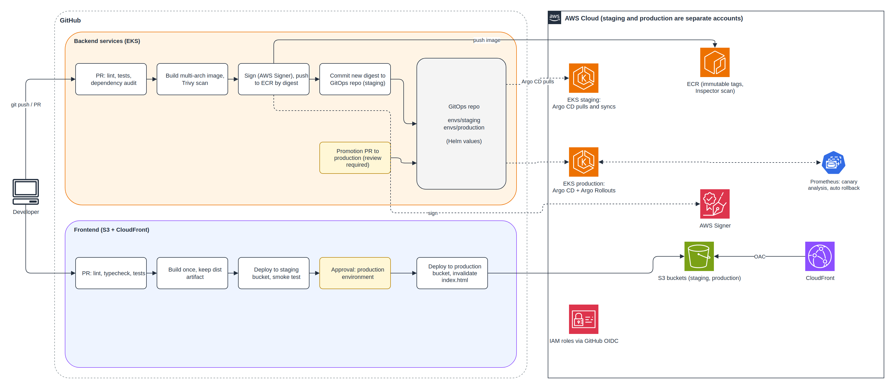

# Problem 4: Ship It Twice

## Executive Summary

Two applications ship to production through GitHub Actions: the **backend services**, running on the EKS platform from [Problem 1](../problem1/SOLUTION.md), and the **frontend**, a static web app served from S3 through CloudFront. "Ship it twice" is also the core rule of this design: **every change ships to staging first, then to production, as the exact same artifact.**

| Principle | What it means here |
|---|---|
| **Build once, promote the same artifact** | One image digest (backend) and one build artifact (frontend) go to staging, then production. Nothing is rebuilt for production |
| **GitOps for the cluster** | CI never talks to the Kubernetes API. It updates a Git repository; Argo CD inside each cluster pulls the change. This fits the private API endpoint in [Problem 5](../problem5/SOLUTION.md) |
| **Progressive delivery** | Production releases go out as a canary, checked automatically against Prometheus metrics, and roll back on their own |
| **No stored cloud credentials** | GitHub Actions gets short-lived AWS credentials through OIDC |

---

## Assumptions

| Assumption | Rationale |
|---|---|
| Backend services are containers deployed to EKS (Problem 1) | The platform's core. If a service had to run on plain EC2, the same pipeline would stop at ECR and swap the deploy stage for an Auto Scaling instance refresh |
| Frontend is a static single-page app | Served from S3 + CloudFront; no servers to deploy |
| GitHub is the source control and CI system | GitHub Actions for CI, GitHub Environments for approvals |
| A separate **GitOps repository** holds the Kubernetes manifests (Helm values per environment) | Separates "what code" (app repo) from "what is running where" (GitOps repo), with a clean audit trail |
| Staging and production are separate clusters in separate AWS accounts | Problem 1, ADR-005 |
| GitHub Flow: short-lived branches, pull requests into `main` | One version in production at a time; no release branches needed |

---

## Pipeline Architecture



> Editable draw.io source in `diagrams/`.

---

## Branching Strategy

```
feature/* ──PR──▶ main ──▶ staging (automatic) ──▶ production (approved promotion)
```

| Rule | Why |
|---|---|
| `main` is protected: pull request, 1 approval, all checks green | No unreviewed code reaches any environment |
| Merge to `main` deploys to staging automatically | Fast feedback on every change |
| Production requires an approved promotion | A human decision, with an audit trail of who approved what |
| No `develop`, `release/*` or `hotfix/*` branches | One version in production; a hotfix is just a small PR that goes through the same fast path |
| Rollback is a Git revert in the GitOps repo (or automatic, see below) | Recovery is fast and recorded |

---

## How Each Pipeline Works

### Backend: Continuous Integration (every pull request)

| Stage | Tools | Fails the build when |
|---|---|---|
| Lint and unit tests | ESLint, test runner | Any error |
| Integration tests | GitHub Actions service containers (Postgres, Redis) | Any failure |
| Dependency audit | `npm audit` | HIGH or CRITICAL vulnerabilities |
| Build image | Docker Buildx (multi-arch: arm64 for Graviton, amd64 as fallback) | Build failure |
| Scan image | Trivy | Fixable HIGH or CRITICAL CVEs |
| Validate manifests | `helm lint`, `kubeconform`, Kyverno CLI against the cluster policies | Manifest would be rejected by the cluster |

The image is built but **not pushed** on pull requests, so the registry only contains code that passed review.

### Backend: Continuous Delivery (merge to `main`)

```
1. Build + scan again (same as CI)
2. Sign the image with AWS Signer (Notation)
3. Push to ECR, record the image digest (sha256:...)
4. Open and auto-merge a commit in the GitOps repo: envs/staging/values.yaml → new digest
5. Argo CD in the staging cluster detects the change and syncs
6. Post-sync smoke tests run as an Argo CD hook (Kubernetes Job)
7. CI opens a promotion PR: envs/production/values.yaml → same digest
8. A reviewer approves and merges the promotion PR
9. Argo CD in production syncs; Argo Rollouts runs a canary (next section)
```

Example of the key step in GitHub Actions:

```yaml
jobs:
  release:
    runs-on: ubuntu-latest
    environment: staging
    permissions:
      id-token: write   # OIDC token for AWS; no stored keys
      contents: read
    steps:
      - uses: actions/checkout@v4
      - uses: aws-actions/configure-aws-credentials@v4
        with:
          role-to-assume: ${{ vars.ECR_PUSH_ROLE_ARN }}
          aws-region: ap-southeast-1
      - uses: aws-actions/amazon-ecr-login@v2
        id: ecr
      - name: Build, push, sign
        run: |
          IMAGE=${{ steps.ecr.outputs.registry }}/order-api:${{ github.sha }}
          docker buildx build --platform linux/arm64,linux/amd64 -t "$IMAGE" --push backend/
          # ...sign with AWS Signer, capture digest, commit it to the GitOps repo
```

### Why GitOps (Argo CD) Instead of `kubectl apply` from CI

| Push model (CI runs `kubectl` / `helm upgrade`) | Pull model (Argo CD) |
|---|---|
| CI needs cluster credentials and network access to the API | CI needs only Git write access; the cluster API stays private |
| Manual changes in the cluster drift silently | Argo CD detects drift and reverts it |
| Rollback = rerun an old pipeline | Rollback = `git revert` |
| Cluster state is "whatever the last job did" | Cluster state = what Git says, for every environment |

### Production Rollout: Canary with Automatic Analysis

In production, each service is an **Argo Rollouts** `Rollout` instead of a plain `Deployment`. Traffic shifts gradually through the ALB, and each step is checked against Prometheus (Problem 3):

| Step | Traffic to new version | Automatic check (5 minutes each) |
|---|---|---|
| 1 | 10% | Error rate < 1% and p99 latency < 150 ms |
| 2 | 30% | Same |
| 3 | 60% | Same |
| 4 | 100% | Done |

If a check fails, Argo Rollouts **aborts and shifts all traffic back** to the previous version, without anyone intervening.

```yaml
# Simplified
strategy:
  canary:
    trafficRouting:
      alb:
        ingress: order-api
        servicePort: 80
    steps:
      - setWeight: 10
      - analysis: { templates: [{ templateName: error-rate-and-latency }] }
      - setWeight: 30
      - analysis: { templates: [{ templateName: error-rate-and-latency }] }
      - setWeight: 60
      - analysis: { templates: [{ templateName: error-rate-and-latency }] }
```

**Special case: the matching engine.** It is stateful and must never run two active versions. It uses a **blue-green** release instead: the new version starts as the standby, catches up on the event stream, and becomes active through a controlled switchover during a low-traffic window.

### Frontend Pipeline

| Stage | Detail |
|---|---|
| **Pull request** | Lint, typecheck, unit tests, `npm audit`, production build |
| **Merge to `main`** | Build **once**; store the `dist` output as a workflow artifact |
| **Deploy to staging** | Upload to the staging bucket, write a staging `config.json` (API URL etc.), smoke test |
| **Approval** | GitHub `production` environment with required reviewers |
| **Deploy to production** | The **same artifact**, production `config.json`, then CloudFront invalidation |

**Upload order matters:**

1. Hashed assets first (`assets/app.3f9c2.js`), cached for a year and marked `immutable`.
2. `index.html` and `config.json` **last**, with `no-cache`. Users switch to the new release only when everything it references already exists.
3. Invalidate only `/index.html` and `/config.json`. Hashed files never need invalidation.

Old hashed assets are kept for a while, so users with the previous page open do not get errors.

---

## Rollback Strategy

| Situation | Backend | Frontend | Time |
|---|---|---|---|
| Canary fails its checks | **Automatic**: Argo Rollouts shifts traffic back | n/a | Seconds |
| Problem found after full rollout | `git revert` the promotion commit; Argo CD syncs the previous digest | Re-run the deploy job with a previous run's artifact (kept 90 days) | 2 to 5 minutes |
| Emergency, CI unavailable | `argo rollouts undo` from an admin session | Restore previous object versions of `index.html` and `config.json` (bucket versioning) | Minutes |

Database migrations follow **expand, then contract**: new columns and tables are added in one release and old ones removed in a later one, so any release can be rolled back without touching the schema.

---

## Security in CI/CD

| Risk | Mitigation |
|---|---|
| Leaked cloud credentials | No AWS keys stored in GitHub. OIDC roles per environment; each role's trust policy only accepts its own repository and environment |
| CI able to change the cluster directly | It cannot: CI only writes to Git; Argo CD pulls |
| Unreviewed production changes | Branch protection plus required reviewers on production promotions and on the `production` environment |
| Malicious or vulnerable images | Trivy in CI, Inspector in ECR, signing with AWS Signer, and Kyverno in the cluster **rejects unsigned images** (Problem 5) |
| Tampered tags | ECR tag immutability; deployments reference digests, never tags |
| Compromised third-party actions | Pin actions to full commit SHAs; Dependabot proposes updates |
| Secrets in the pipeline | Runtime secrets live in Secrets Manager and reach pods through External Secrets; nothing secret is in images, Git or logs |

---

## What "Production-Ready" Means Here

| Criterion | How it is met |
|---|---|
| No manual steps on the happy path | Merge → staging automatically; one approval → production |
| Safe by default | Canary with automatic analysis and rollback |
| Rollback under 5 minutes | Automatic on canary failure; `git revert` otherwise |
| Full audit trail | Every deployment is a Git commit and an approval record |
| Environments isolated | Separate accounts, clusters, roles and buckets |
| Fast feedback | PR checks in under 10 minutes; staging deploy within minutes of merge |

---

## Disaster Recovery

The pipeline above also makes **disaster recovery** much simpler: if a whole region is lost, the platform can be rebuilt from code in another region.

| Layer | How it is recovered | RPO (data loss) | RTO (time to restore) |
|---|---|---|---|
| Network, EKS, IAM | Terraform recreates them in the DR region (for example Tokyo, `ap-northeast-1`) | n/a | ~1 hour |
| Workloads | Argo CD in the new cluster syncs the same GitOps repository | n/a | Minutes after the cluster exists |
| Images | ECR cross-region replication | 0 | Already there |
| Aurora (ledger) | Aurora Global Database, promoted in the DR region | ~1 second | Minutes |
| MSK (events) | MSK Replicator to the DR region | Seconds | Minutes |
| ElastiCache | Rebuilt from Aurora (it is a cache) | n/a | Minutes |
| Frontend | S3 cross-region replication; CloudFront origin failover | Minutes | Automatic |
| DNS | Route 53 failover records | n/a | Minutes |

**Overall target: RPO under 1 minute, RTO under 2 hours** (warm standby for data, rebuild-from-code for compute). Recovery is rehearsed twice a year on staging; an untested DR plan is a hope, not a plan.

---

## What We Deliberately Left Out

| Feature | Why |
|---|---|
| Preview environment per pull request | Useful, but needs dynamic namespaces, DNS and data seeding; a later improvement |
| Full end-to-end browser tests in the pipeline | Worth adding as a gate before production once staging data is stable |
| Automatic promotion to production without approval | A trading platform handles money; a human approval is cheap insurance |
| Argo CD Image Updater | CI commits digests explicitly instead, which keeps promotion visible in pull requests |
| Separate CI tool (Jenkins, CodePipeline) | GitHub Actions covers the need without another system to run |

---

## Key Insight

The safest deployment pipeline is one where **production is never the first place a change runs**, and where undoing a change is as easy as making one. Building once, promoting the same artifact, letting Git be the source of truth, and letting metrics decide whether a canary survives gives exactly that.
