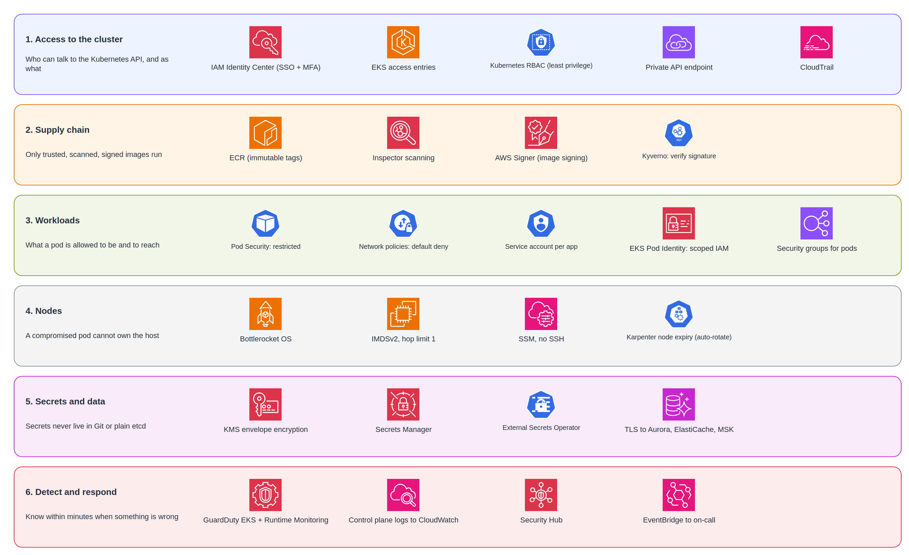

# Problem 5: Fortify The Castle

## Executive Summary

In [Problem 1](../problem1/SOLUTION.md), Amazon EKS is the core of the platform: every application service runs there. That makes the cluster the most valuable target. Anyone who controls it can read secrets, reach the databases, and change what code runs.

This document hardens the cluster with **six layers of defense**, so that no single mistake or compromised component gives an attacker the whole system:

1. **Access to the cluster**: who can talk to the Kubernetes API, and with what rights
2. **Supply chain**: only trusted, scanned, signed images can run
3. **Workloads**: what a pod is allowed to be, and what it can reach
4. **Nodes**: a compromised pod cannot take over the host
5. **Secrets and data**: secrets never sit in Git or in plain text
6. **Detect and respond**: we know within minutes when something is wrong



> Editable draw.io source in `diagrams/`.

---

## Threat Model for the Cluster

Before choosing controls, we name the realistic attacks against a Kubernetes-based platform:

| # | Threat | Example attack path | Impact | Main controls (layer) |
|---|---|---|---|---|
| T1 | Stolen engineer credentials | Phished laptop session is used to run `kubectl` | Full cluster control | SSO + MFA, private API endpoint, least-privilege RBAC, audit logs (1, 6) |
| T2 | Malicious or vulnerable image | Compromised dependency ships in a new image | Code execution inside the cluster | Scanning, signing, admission verification (2) |
| T3 | Compromised application pod | Remote code execution through an app bug | Pivot to other pods, databases, AWS APIs | Pod Security, network policies, scoped Pod Identity roles (3) |
| T4 | Container escape to node | Privileged pod or kernel exploit | Every pod on the node; the node's IAM role | Restricted pods, Bottlerocket, IMDS lockdown (3, 4) |
| T5 | Secrets exposure | Secret committed to Git, or read from etcd | Database and third-party credentials leaked | External Secrets + Secrets Manager, KMS encryption, RBAC on secrets (5) |
| T6 | Credential theft from instance metadata | Pod calls `169.254.169.254` to get node credentials | Node role abused to pull images, modify ENIs | IMDSv2 with hop limit 1, Pod Identity (4) |
| T7 | Lateral movement inside the cluster | Compromised worker pod calls the matching engine directly | Order manipulation | Default-deny network policies, namespace isolation (3) |
| T8 | Undetected persistence | Attacker creates a hidden DaemonSet or cluster role | Long-term access | Audit logs, GuardDuty, policy enforcement (1, 6) |

---

## Layer 1: Access to the Cluster

| Control | Implementation | Why |
|---|---|---|
| **Private API endpoint** | Public endpoint disabled. The API is reachable only from inside the VPC (CI runners, VPN or SSM-based access) | Removes the Kubernetes API from the internet entirely |
| **SSO for humans** | Engineers sign in through IAM Identity Center with MFA; short sessions (1 to 8 hours) | No long-lived IAM users or keys that can leak |
| **EKS access entries** | Authentication mode set to API only; the legacy `aws-auth` ConfigMap is not used | Access is managed through the AWS API, is auditable in CloudTrail, and cannot be broken by a bad ConfigMap edit |
| **No permanent cluster-admin** | The cluster creator's automatic admin permission is disabled at creation. Admin access is a separate break-glass role that requires approval and pages the security team when used | The most dangerous permission is not held day to day |
| **Least-privilege RBAC** | Developers: read-only in their team's namespaces. Deploys happen only through CI/CD service identities. Nobody gets `get secrets` in production namespaces | Limits what a stolen credential can do |
| **Audit trail** | EKS control plane logs enabled: `api`, `audit`, `authenticator` sent to CloudWatch Logs | Every API call is recorded, including who ran it |

**Access model:**

| Role | Access entry policy | Scope |
|---|---|---|
| Developers | `AmazonEKSViewPolicy` | Own team namespaces |
| On-call SRE | `AmazonEKSEditPolicy` | Application namespaces, no secrets |
| CI/CD deployer | Custom RBAC role | Deployments, services, config in application namespaces |
| Break-glass admin | `AmazonEKSClusterAdminPolicy` | Cluster-wide, approval required, alerted |

---

## Layer 2: Supply Chain

| Control | Implementation | Why |
|---|---|---|
| **Private registry only** | Admission policy rejects images not from our ECR account | Blocks pulling random images from the internet |
| **Immutable tags** | ECR tag immutability on; deployments reference images by digest | A tag cannot be silently repointed to a different image |
| **Vulnerability scanning** | Amazon Inspector enhanced scanning on push and continuously afterwards; CI blocks fixable HIGH and CRITICAL findings | Catches known CVEs before and after deployment |
| **Image signing** | CI signs every image with AWS Signer (Notation) | Proves the image came from our pipeline |
| **Signature verification at admission** | Kyverno verifies the signature before a pod is admitted | An unsigned image, even from our own ECR, cannot run |
| **Minimal base images** | Distroless or small Alpine-based images | Fewer packages means fewer vulnerabilities and no shell for an attacker |

---

## Layer 3: Workloads

| Control | Implementation | Why |
|---|---|---|
| **Pod Security Admission: restricted** | Every application namespace enforces the `restricted` profile | Blocks privileged pods, host namespaces, root users and privilege escalation |
| **Kyverno policies** | Require resource limits, readiness probes, non-`latest` tags, approved registries; block `hostPath` volumes | Guardrails that apply to every team the same way |
| **Default-deny network policies** | Enforced by the VPC CNI's native network policy support. Each namespace denies all traffic, then allows only declared flows | A compromised pod can only reach what its service legitimately needs |
| **Security groups for pods** | Only pods in `trading-api` and `trading-workers` get the security group that Aurora accepts | Database access is enforced at the AWS network layer, not only inside Kubernetes |
| **One service account per workload** | `automountServiceAccountToken: false` unless the app needs the Kubernetes API | Pods do not carry API credentials they never use |
| **EKS Pod Identity with scoped roles** | Each service account has its own IAM role, for example the account service can read only its own secret | A compromised pod gets one narrow role, not the node's role |
| **Namespace isolation** | Resource quotas and limit ranges per namespace; matching engine in its own namespace on dedicated, tainted nodes | Noisy or compromised workloads cannot starve or reach the core |

**Example: enforce restricted pods and deny all traffic by default**

```yaml
apiVersion: v1
kind: Namespace
metadata:
  name: trading-api
  labels:
    pod-security.kubernetes.io/enforce: restricted
    pod-security.kubernetes.io/audit: restricted
---
apiVersion: networking.k8s.io/v1
kind: NetworkPolicy
metadata:
  name: default-deny-all
  namespace: trading-api
spec:
  podSelector: {}
  policyTypes: ["Ingress", "Egress"]
```

Explicit allow policies are then added per flow, for example ALB to Order API, Order API to MSK, and all pods to CoreDNS.

---

## Layer 4: Nodes

| Control | Implementation | Why |
|---|---|---|
| **Bottlerocket OS** | All node pools use Bottlerocket | Minimal, read-only root filesystem, no package manager, SELinux enforcing |
| **No SSH** | No SSH keys, no port 22. Emergency access through SSM Session Manager (logged) | Removes a common entry point |
| **IMDSv2 with hop limit 1** | Set in the launch templates (Karpenter `EC2NodeClass`) | Pods cannot reach the instance metadata service to steal the node's credentials |
| **Minimal node IAM role** | Only what the kubelet and VPC CNI need; applications use Pod Identity instead | A node compromise gives little AWS access |
| **Automatic node rotation** | Karpenter `expireAfter` replaces nodes every 14 days with the latest Bottlerocket AMI | Patches roll out continuously without manual work |
| **Private nodes** | Nodes run in private subnets with no public IPs; security groups allow only control plane and required traffic | Nodes are not reachable from the internet |
| **Encrypted volumes** | EBS volumes encrypted with KMS | Protects data at rest |

---

## Layer 5: Secrets and Data

| Control | Implementation | Why |
|---|---|---|
| **Secrets Manager is the source of truth** | Database passwords, API keys and third-party tokens live in Secrets Manager with rotation | Secrets are never committed to Git or baked into images |
| **External Secrets Operator** | Syncs only the secrets each namespace needs into Kubernetes, and refreshes them after rotation | Applications keep reading normal Kubernetes secrets; rotation just works |
| **KMS envelope encryption** | Kubernetes secrets in etcd encrypted with a customer-managed KMS key | We control the key policy, rotation and audit of every decrypt |
| **RBAC on secrets** | Only the owning service account can read its secret; humans cannot list secrets in production | A stolen developer credential does not reveal secrets |
| **Encryption in transit** | TLS to Aurora (`rds.force_ssl`), ElastiCache (in-transit encryption), MSK (TLS + IAM auth); ALB to pods over HTTPS | Protects credentials and data inside the VPC too |
| **IAM database authentication** | Services connect to Aurora with short-lived IAM tokens where supported | Fewer static passwords to manage |

---

## Layer 6: Detect and Respond

| Control | Implementation | Why |
|---|---|---|
| **GuardDuty EKS Protection** | Analyzes EKS audit logs for suspicious activity: anonymous access, privileged pod creation, known malicious IPs | Detects attacks on the control plane |
| **GuardDuty Runtime Monitoring** | Security agent add-on on every node | Detects crypto miners, reverse shells, container escapes |
| **Control plane logs** | `api`, `audit`, `authenticator` logs in CloudWatch Logs, retained for 1 year | Investigation and evidence |
| **Security Hub** | Aggregates GuardDuty and Inspector findings; runs AWS Foundational Security Best Practices checks for EKS | One place to see and track findings |
| **Alerting** | High-severity findings go through EventBridge to Slack and PagerDuty | Someone is woken up, not just a log line written |
| **Kubernetes-specific alerts** | Alerts (from audit logs) when anyone uses the break-glass role, creates a ClusterRoleBinding, execs into a production pod, or reads a secret | These actions are rare and should always be reviewed |
| **Regular benchmarking** | `kube-bench` (CIS Amazon EKS Benchmark) runs weekly; results tracked | Catches configuration drift |

**Incident playbook (compromised pod):**

1. Isolate: apply a deny-all network policy to the pod's labels and cordon the node.
2. Preserve: snapshot the node's EBS volume and export audit logs before anything is deleted.
3. Revoke: remove the Pod Identity association and rotate every secret the pod could read.
4. Replace: delete the pod and node; Karpenter provides a clean node.
5. Review: find the entry point through audit logs and GuardDuty findings, fix the root cause, and write a postmortem.

---

## Priority Matrix

### P0: Before Go-Live

| Control | Why non-negotiable |
|---|---|
| Private API endpoint + SSO with MFA + access entries | The cluster API must not be exposed or reachable with long-lived credentials |
| No permanent cluster-admin; least-privilege RBAC | Limits damage from any stolen credential |
| EKS Pod Identity for all workloads; IMDSv2 hop limit 1 | Prevents credential theft through the node |
| Pod Security Admission `restricted` in application namespaces | Blocks the most common container escape paths |
| Secrets Manager + External Secrets; KMS encryption | No secrets in Git or plain etcd |
| Control plane audit logging | Without it, incidents cannot be investigated |
| ECR scanning with CI gate | Known critical CVEs never reach production |

### P1: First Month

| Control | Why now |
|---|---|
| Default-deny network policies | Needs a map of real service-to-service flows first |
| GuardDuty EKS Protection + Runtime Monitoring | Detection once the platform is live |
| Kyverno baseline policies (registry, limits, no `latest`) | Starts in audit mode, then enforce once violations are fixed |
| Bottlerocket + Karpenter node expiry | Rolling node replacement once workloads tolerate it |
| Security groups for pods on database access | Adds AWS-level enforcement on top of network policies |

### P2: First Quarter

| Control | Why later |
|---|---|
| Image signing with admission verification | Requires CI changes and a rollout plan so no service is blocked |
| Security Hub + weekly kube-bench reporting | Needs owners and a process to act on findings |
| Kubernetes-specific audit alerts | Needs a baseline to avoid alert fatigue |
| Incident response game day | Practise the playbook on staging |

---

## Cost of Security

Rough monthly additions for one production cluster:

| Item | Monthly |
|---|---|
| GuardDuty (EKS audit logs + Runtime Monitoring) | $50 to $150 |
| Amazon Inspector (ECR image scanning) | $20 to $50 |
| Security Hub | $20 to $50 |
| CloudWatch Logs for control plane logs | $30 to $100 (the audit log is the largest) |
| KMS keys and requests | ~$10 |
| Kyverno, External Secrets, kube-bench | $0 (open source, runs on existing system nodes) |
| **Total** | **~$130 to $360 / month** |

Most of the protection comes from **configuration**, not paid products.

---

## What We Deliberately Left Out

| Omission | Reasoning |
|---|---|
| Service mesh with mTLS between all pods | Network policies, security groups for pods and TLS to data stores cover the main risks. A mesh adds latency and complexity to the trading path; revisit if compliance requires encrypted pod-to-pod traffic |
| Third-party runtime security platform | GuardDuty Runtime Monitoring covers the core detections natively; revisit if the security team needs custom rules |
| Separate cluster per team | One production cluster with strong namespace isolation is enough at this size; the matching engine already has dedicated nodes |
| Fully air-gapped cluster (no NAT at all) | Possible with VPC endpoints only, but some workloads call external services. Egress is restricted instead |

---

## Key Insight

Kubernetes is **open by default**: any pod can talk to any pod, any image can run, and a node's credentials are one HTTP call away. Hardening EKS is mostly about **closing those defaults**, layer by layer, so that the cluster being the core of the platform does not make it a single point of compromise.
